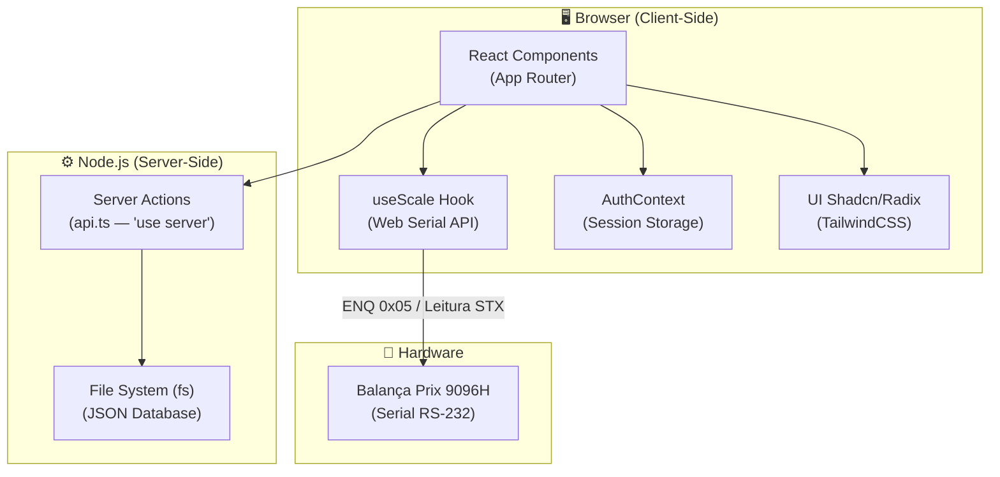
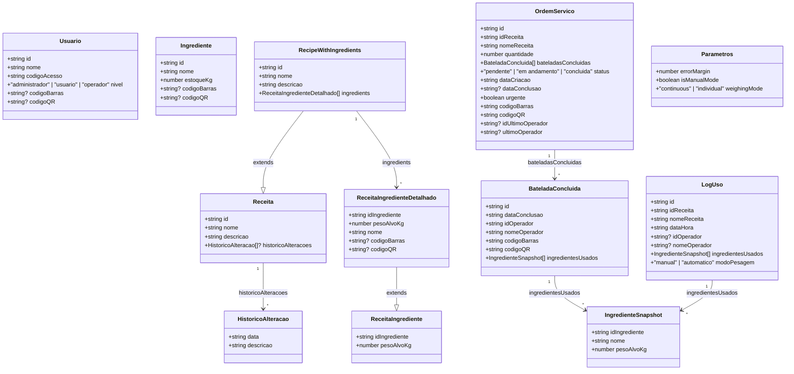
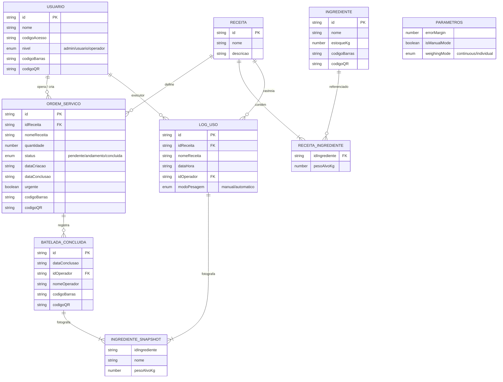
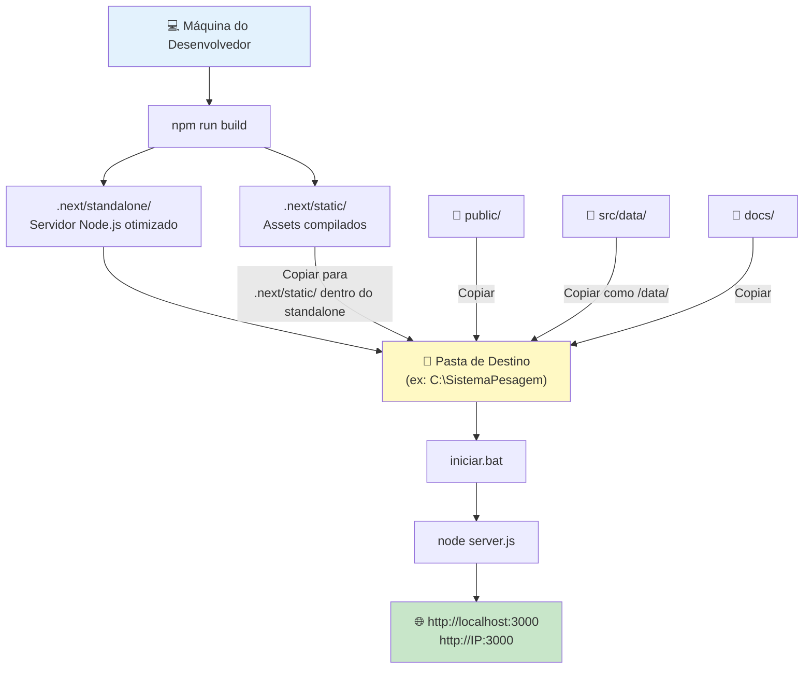
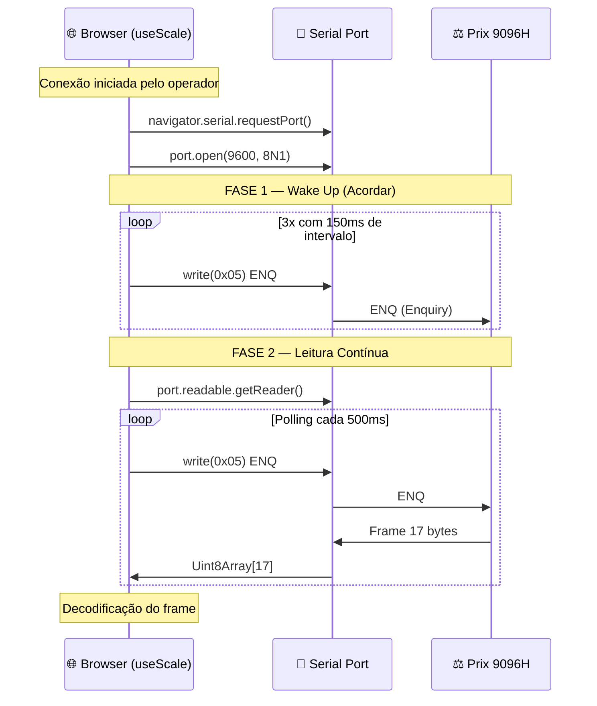
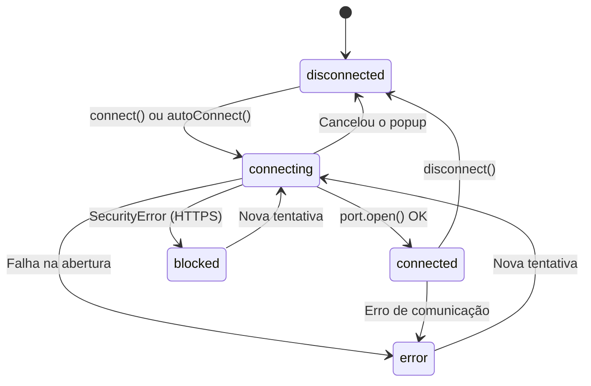
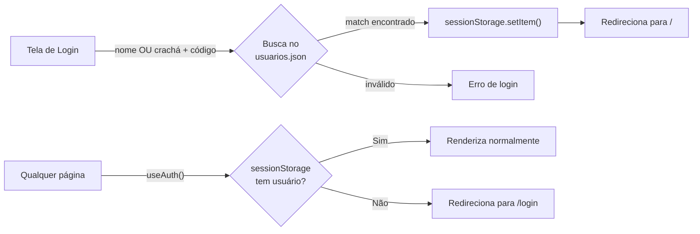
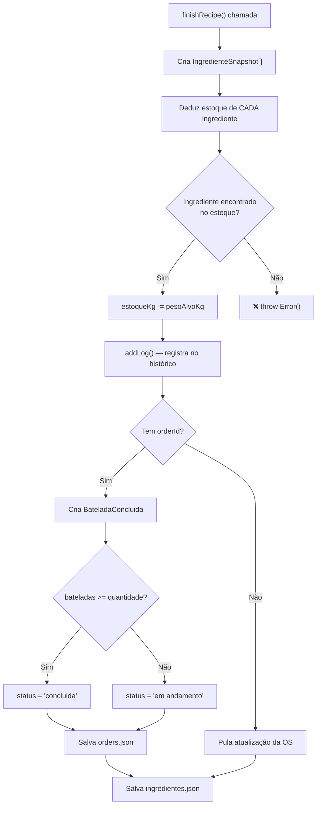



# 💻 Guia do Desenvolvedor

## Arquitetura Geral
Este software (Sistema de Pesagem 1.3) utiliza o framework **Next.js** (App Router), escrito em tipagem estrita com **TypeScript** e hospedando seu visual com **TailwindCSS**.   

O principal atrativo técnico na arquitetura offline deste sistema é a sua **Integração Real-Time com Hardware** sem o uso de websockets instáveis, mas usando nativamente a **Web Serial API do HTML5**. Aliado a isso, ele dispensa totalmente bases de dados como Postgres e fia-se unicamente na leitura/gravação de arquivos JSON hospedados na pasta `src/data/` do servidor Edge/Node local, garantindo zero chance de falhas de conexão em um chão de fábrica sem internet.



---

## 1. Tipos de Dados (TypeScript)

Abaixo estão **todos** os tipos definidos em `src/lib/types.ts`, representados em diagrama Mermaid com campos e tipagem.



### Relações entre Entidades



---

## 2. Estrutura de Pastas do Projeto

Abaixo está o mapa completo de **todas** as pastas e arquivos relevantes para o desenvolvedor:

```
Sistema de Pesagem 1.3/
│
├── 📄 package.json              # Dependências e scripts (dev, build, start)
├── 📄 next.config.ts            # Output: standalone, imagens remotas, server actions
├── 📄 tailwind.config.ts        # Tema Tailwind, cores, fontes, plugins
├── 📄 tsconfig.json             # Configuração TypeScript
├── 📄 components.json           # Configuração do Shadcn UI CLI
├── 📄 postcss.config.mjs        # PostCSS para Tailwind
├── 📄 apphosting.yaml           # (Referência) Firebase App Hosting
├── 📄 iniciar.bat               # Script de execução standalone no Windows
│
├── 📁 docs/                     # Documentação Jekyll / GitHub Pages
│   ├── _config.yml              # Theme: jekyll-theme-minimal
│   ├── index.md                 # Página inicial da documentação
│   ├── user-guide.md            # Guia do Operador
│   ├── admin-guide.md           # Guia do Administrador
│   ├── developer-guide.md       # Este arquivo
│   └── blueprint.md             # Especificação original do projeto
│
├── 📁 public/                   # Arquivos estáticos servidos diretamente
│   └── logo.svg                 # Logo Protege Nutrição Animal
│
└── 📁 src/                      # Código-fonte principal
    │
    ├── 📁 app/                  # Rotas do Next.js (App Router)
    │   ├── layout.tsx           # Layout raiz (AuthProvider, Toaster, fontes)
    │   ├── page.tsx             # "/" — Dashboard de Ordens de Serviço
    │   ├── globals.css          # CSS global + variáveis HSL do tema
    │   ├── favicon.ico          # Ícone do navegador
    │   │
    │   ├── 📁 login/
    │   │   └── page.tsx         # "/login" — Tela de login (crachá + senha)
    │   │
    │   ├── 📁 weighing/
    │   │   └── 📁 [id]/
    │   │       └── page.tsx     # "/weighing/:id" — Tela de pesagem com balança
    │   │
    │   ├── 📁 admin/
    │   │   ├── 📁 orders/
    │   │   │   └── page.tsx     # "/admin/orders" — CRUD de Ordens de Serviço
    │   │   ├── 📁 ingredients/
    │   │   │   └── page.tsx     # "/admin/ingredients" — CRUD de Ingredientes
    │   │   ├── 📁 receitas/
    │   │   │   └── page.tsx     # "/admin/receitas" — CRUD de Receitas
    │   │   ├── 📁 users/
    │   │   │   └── page.tsx     # "/admin/users" — CRUD de Usuários
    │   │   └── 📁 history/
    │   │       └── page.tsx     # "/admin/history" — Logs de pesagem
    │   │
    │   └── 📁 docs/
    │       ├── page.tsx         # "/docs" — Lista de documentos Markdown
    │       └── 📁 [slug]/
    │           └── page.tsx     # "/docs/:slug" — Renderização via react-markdown
    │
    ├── 📁 components/
    │   ├── Header.tsx           # Barra de navegação superior + mobile sheet
    │   └── 📁 ui/               # Componentes Shadcn UI (Button, Card, Dialog, etc.)
    │
    ├── 📁 context/
    │   └── AuthContext.tsx       # Provider de autenticação via Session Storage
    │
    ├── 📁 hooks/
    │   ├── useScale.ts          # Hook mestre da comunicação serial (Prix 9096H)
    │   └── use-toast.ts         # Hook de notificação toast (Shadcn)
    │
    ├── 📁 lib/
    │   ├── types.ts             # Definições de TODOS os tipos TypeScript
    │   ├── api.ts               # Server Actions (CRUD JSON via fs)
    │   ├── utils.ts             # Utilitário cn() (clsx + tailwind-merge)
    │   ├── placeholder-images.ts
    │   └── placeholder-images.json
    │
    ├── 📁 data/                 # "Banco de Dados" JSON (em dev: src/data, em prod: /data)
    │   ├── ingredientes.json    # Lista de ingredientes com estoque
    │   ├── receitas.json        # Lista de receitas com ingredientes-ref
    │   ├── orders.json          # Ordens de serviço (OS)
    │   ├── usuarios.json        # Cadastro de usuários
    │   ├── log_uso.json         # Histórico de pesagens
    │   └── parametros.json      # Configurações globais (margem, modo, etc.)
    │
    └── 📁 ai/                   # (Reservado) Integração Genkit AI
        └── dev.ts               # Arquivo de desenvolvimento Genkit
```

---

## 3. Fluxo de Instalação para Desenvolvimento

### 3.1. Pré-requisitos
- **Node.js** >= 18 (recomendado 20 LTS)
- **npm** >= 9
- **Google Chrome** ou **Microsoft Edge** (para Web Serial API)
- **Git** (opcional, para versionamento)

### 3.2. Clonando e Instalando

```bash
# 1. Clone o repositório (ou copie a pasta do projeto)
git clone <repo-url> "Sistema de Pesagem 1.3"
cd "Sistema de Pesagem 1.3"

# 2. Instale TODAS as dependências do projeto
npm install
```

> **⚠️ IMPORTANTE:** O comando `npm install` instalará as seguintes dependências-chave:
> - `next@15.3.x` — Framework React SSR/SSG (App Router)
> - `react@18.x` / `react-dom@18.x` — Biblioteca UI
> - `typescript@5.9.x` — Tipagem estática
> - `@radix-ui/*` — Primitivos acessíveis (Shadcn UI)
> - `tailwindcss` + `@tailwindcss/typography` — Estilização
> - `react-barcode` / `react-qr-code` — Geração de códigos
> - `react-to-print` — Impressão de etiquetas
> - `react-markdown` — Renderização da documentação offline
> - `react-hook-form` + `zod` — Validação de formulários
> - `date-fns` — Manipulação de datas
> - `recharts` — Gráficos estatísticos
> - `lucide-react` — Ícones vetoriais
> - `gray-matter` — Parser de frontmatter Markdown
> - `genkit` + `@genkit-ai/*` — (Reservado) IA Generativa
> - `dotenv` — Variáveis de ambiente

### 3.3. Rodando em Desenvolvimento

```bash
npm run dev
```

Isso executa `next dev --turbopack -p 9002`, iniciando o servidor de desenvolvimento com **Turbopack** na porta **9002**.

- Acesse: `http://localhost:9002`
- Hot-reload ativo para todos os componentes React
- Os dados JSON são lidos/gravados de `src/data/` (diretório de desenvolvimento)

### 3.4. Scripts Disponíveis

| Script | Comando | Descrição |
|---|---|---|
| `dev` | `next dev --turbopack -p 9002` | Servidor de desenvolvimento com hot-reload |
| `build` | `next build` | Gera o bundle de produção + standalone |
| `start` | `next start -p 3000` | Serve o build de produção na porta 3000 |
| `lint` | `next lint` | Verifica qualidade de código (ESLint) |
| `typecheck` | `tsc --noEmit` | Verifica tipos TypeScript sem emitir |
| `genkit:dev` | `genkit start -- tsx src/ai/dev.ts` | Inicia o Genkit em modo dev |

---

## 4. Deploy Standalone (Produção Offline)

O sistema foi projetado para rodar **100% offline** em chão de fábrica sem internet. O Next.js é configurado com `output: 'standalone'` no `next.config.ts`.

### 4.1. Fluxo Completo de Build & Deploy



### 4.2. Passo a Passo para Implantar

```bash
# 1. Gerar o bundle de produção
npm run build
```

**2. Organizar os arquivos na pasta de destino (ex: `C:\SistemaPesagem`)**:

| Origem (projeto) | Destino (produção) | Observação |
|---|---|---|
| `.next/standalone/*` | `C:\SistemaPesagem\*` | Inclui `server.js` e `node_modules` mínimo |
| `.next/static/` | `C:\SistemaPesagem\.next\static\` | Assets CSS/JS compilados |
| `public/` | `C:\SistemaPesagem\public\` | Logo e arquivos estáticos |
| `src/data/` | `C:\SistemaPesagem\data\` | ⚠️ Renomear de `src/data` para apenas `data` |
| `docs/` | `C:\SistemaPesagem\docs\` | Guias Markdown para exibição offline |

> **⚠️ CUIDADO com o caminho dos dados:**
> Em desenvolvimento, `api.ts` lê de `src/data/`. Em produção standalone, lê de `data/` na raiz da pasta de execução. Essa lógica é controlada por:
> ```typescript
> const dataDir = isProd
>   ? path.join(process.cwd(), 'data')        // Produção
>   : path.join(process.cwd(), 'src', 'data'); // Desenvolvimento
> ```

**3. Criar o script `iniciar.bat`** na raiz da pasta de destino:

```bat
@echo off
title Servidor do Sistema de Pesagem
cls

:: Obtém o IP da rede local
for /f "tokens=2 delims=:" %%a in ('ipconfig ^| find "IPv4"') do set IP=%%a
set IP=%IP: =%

echo ====================================================
echo    INICIANDO SERVIDOR DO SISTEMA DE PESAGEM
echo    (NAO FECHE ESTA JANELA)
echo ====================================================
echo.
echo Para acessar o sistema:
echo - Neste computador: http://localhost:3000
echo - Outros dispositivos: http://%IP%:3000
echo.
echo Para parar o servidor, feche esta janela ou pressione CTRL+C.
echo.

set PORT=3000
set HOSTNAME=0.0.0.0

node server.js
pause
```

### 4.3. Sobre o Node.js Empacotado

Como o deploy é standalone, o próprio instalador para o cliente deve carregar um **executável Node.js portátil** (ex: `node.exe` da versão LTS), colocado dentro da pasta de destino ou referenciado pelo `PATH` do sistema. O `iniciar.bat` chamará diretamente esse `node server.js`, sem precisar de `npm`, `npx` ou quaisquer ferramentas de desenvolvimento.

O standalone produz um `server.js` que:
- Importa somente os módulos necessários (nenhum código de dev/debug)
- Traz seu próprio subset mínimo de `node_modules` (redução drástica de tamanho)
- Serve tanto as páginas React renderizadas quanto a API de Server Actions
- Utiliza o `fs` do Node.js para ler/gravar os JSONs como banco de dados local

---

## 5. Comunicação Serial (Balanças Prix 9096H)
Toda a lógica serial mora isolada no Hook Mestre: `src/hooks/useScale.ts`. Estas balanças não transmitem de forma contínua por padrão, elas utilizam um **Modo de Pedido (Polling)**.

### 5.1. Protocolo de Comunicação



### 5.2. Leitura Hexadecimal e "Wake Up" (Acordar)
- **ENQ (Ping de Pedido):** Assim que a porta serial é aberta, um `setInterval` injeta ativamente no `port.writable.getWriter()` o comando hexadecimal **`0x05`** (`ENQ`). Ele é disparado a cada 500ms visando "acordar" a balança e solicitar seu extrato instantâneo.
- **Interpretação do Fluxo (Receiver):** No loop do leitor serial `port.readable.getReader()`, capturamos um Array de Bytes brutos e acumulamos no Buffer. 
- Aguardamos sempre o frame exato da PRIX: `[0x02]` (Byte STX / Start of Text) avisando que o tráfego iniciou, seguido dos bytes do Status de Tara, então os 6 bytes que representam dígitos ASCII do **PESO**, findando com o `[0x0D]` (CR / Terminator). 
- Uma lógica de limpeza decodifica os 6 bytes de peso (em ASCII) e os divide por `100` para converter em casas decimais flutuantes. Esse valor é injetado no estado do React de forma instantânea.

### 5.3. Estrutura do Frame (17 bytes)

```
Byte:  0     1-3        4-9          10-15       16
     [STX] [Status] [Peso 6 dig] [Tara 6 dig]  [CR]
      0x02  3 bytes  ASCII "000000" ASCII       0x0D
```

| Posição | Tamanho | Conteúdo | Descrição |
|---|---|---|---|
| 0 | 1 byte | `0x02` (STX) | Início de transmissão |
| 1–3 | 3 bytes | Status | Indicadores de tara e estabilidade |
| 4–9 | 6 bytes | Peso (ASCII) | Ex: `"001234"` → 12.34 kg |
| 10–15 | 6 bytes | Tara (ASCII) | Valor de tara registrado |
| 16 | 1 byte | `0x0D` (CR) | Terminador do frame |

### 5.4. Configurações da Porta Serial

| Parâmetro | Valor |
|---|---|
| **Baud Rate** | 9600 |
| **Data Bits** | 8 |
| **Parity** | None |
| **Stop Bits** | 1 |
| **Precisão** | 0,01 kg (10 gramas) |

### 5.5. Estados do Hook `useScale`



| Estado | Descrição |
|---|---|
| `disconnected` | Nenhuma porta conectada |
| `connecting` | Aguardando seleção da porta pelo usuário |
| `connected` | Comunicação ativa, peso sendo lido |
| `error` | Erro na comunicação serial |
| `blocked` | Navegador bloqueou o popup (falta permissão ou HTTPS) |

---

## 6. Acesso Local pela Rede e Regras de Segurança (Porta Serial)

Sempre que outro computador ou tablet tentar conectar-se no sistema (por exemplo, acessando `http://192.168.0.50:3000`), a balança será acoplada através de cabos ou bluetooth nestes terminais da fábrica.
Contudo, navegadores bloqueiam por padrão o acesso de hardware (a API Serial HTML5) a URLs HTTP primitivas sem encriptação SSL (sem HTTPS).

### Como Liberar as Leitoras de Balança em Rede Local (Troubleshooting)

**Passo a Passo (Apenas para tablets/computadores dos operadores que usarão a balança offline via HTTP):**
1. No navegador Google Chrome (ou Microsoft Edge), na sua barra de endereços, acesse a configuração oculta cravando o seguinte texto:
   - Para Chrome: `chrome://flags/#unsafely-treat-insecure-origin-as-secure`
   - Para Edge: `edge://flags/#unsafely-treat-insecure-origin-as-secure`
2. Na caixa de texto que aparecer na lista destacada de amarelo, **digite exatamente o endereço do servidor (host) do sistema**, incluindo o `http://` e a porta `3000` (Exemplo: `http://192.168.0.50:3000`).
3. Mude a chave logo ao lado de "*Disabled*" para **Enabled**.
4. Logo abaixo na tela vai pipocar um botão enorme chamado **"Relaunch" (Reiniciar)**. Clique nele para reiniciar o navegador.
5. Pronto! Agora mesmo sendo um HTTP simples na rede Wi-Fi / Lan corporativa, o Chrome vai dar privilégio seguro para abrir o painel de comunicação interativa ao componente da Balança Toledo/Prix.

---

## 7. Sistema de Autenticação

O sistema utiliza uma autenticação simplificada via **Session Storage** do navegador, controlada pelo `AuthContext.tsx`.



### Métodos de Login Suportados
1. **Nome de usuário** (case-insensitive)
2. **Código de barras** do crachá (leitura por scanner)
3. **QR Code** do crachá (leitura por câmera/scanner)

Todos validados contra o campo `codigoAcesso` (senha numérica).

---

## 8. Server Actions (API de Dados)

Toda a camada de dados mora em `src/lib/api.ts` como **Server Actions** (`'use server'`). O Next.js serializa as chamadas automaticamente entre cliente e servidor.

### Funções Exportadas

| Função | Retorno | Descrição |
|---|---|---|
| `getParametros()` | `Parametros` | Lê configurações globais |
| `updateParametros(params)` | `Parametros` | Salva configurações globais |
| `getIngredients()` | `Ingrediente[]` | Lista todos ingredientes |
| `addIngredient(data)` | `Ingrediente` | Cria ingrediente com código gerado |
| `updateIngredient(id, data)` | `Ingrediente` | Atualiza ingrediente |
| `deleteIngredient(id)` | `void` | Exclui ingrediente |
| `getUsers()` | `Usuario[]` | Lista todos usuários |
| `addUser(user)` | `Usuario` | Cria usuário com código gerado |
| `updateUser(id, data)` | `Usuario` | Atualiza usuário |
| `deleteUser(id)` | `void` | Exclui usuário |
| `getRecipes()` | `RecipeWithIngredients[]` | Lista receitas com detalhes |
| `getRecipeById(id)` | `RecipeWithIngredients \| null` | Busca receita por ID |
| `saveRecipe(data, id?)` | `RecipeWithIngredients` | Cria ou atualiza receita |
| `deleteRecipe(id)` | `void` | Exclui receita |
| `getLogs()` | `LogUso[]` | Lista histórico de pesagens |
| `addLog(log)` | `LogUso` | Registra pesagem no histórico |
| `getOrders()` | `OrdemServico[]` | Lista todas as OS |
| `saveOrder(data, id?)` | `OrdemServico` | Cria ou atualiza OS |
| `deleteOrder(id)` | `void` | Exclui OS |
| `apiCheckStock(recipe)` | `boolean` | Verifica estoque para receita |
| `finishRecipe(recipe, operator, orderId?, modo?)` | `void` | Finaliza pesagem completa |

### Fluxo de `finishRecipe()`



---

## 9. Documentação Embarcada (Jekyll + React-Markdown)

O sistema possui documentação dual:
1. **GitHub Pages / Jekyll**: Os arquivos `.md` na pasta `docs/` com frontmatter Jekyll são publicados automaticamente se o GitHub Pages estiver habilitado no repositório.
2. **Renderização Offline**: A rota `/docs` no Next.js lê os mesmos arquivos `.md` usando `gray-matter` (frontmatter) e `react-markdown` (renderização), permitindo que operadores acessem a documentação sem internet através do próprio sistema.

---
> **Suporte Comercial e Técnico:** (51) 99231-8220 | (51) 99707-1562 | comercial@codars.com.br
