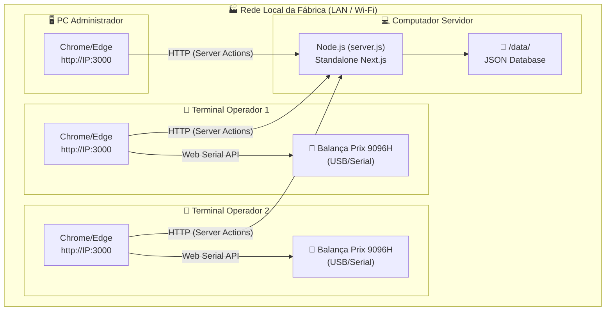
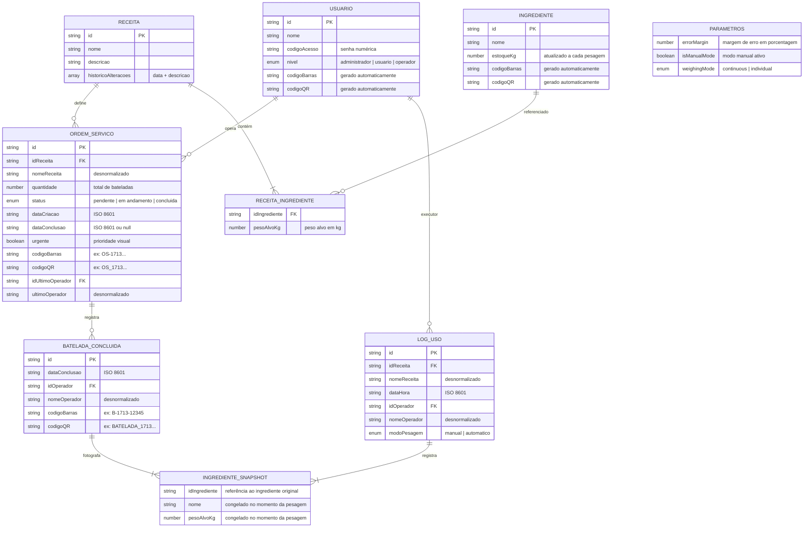
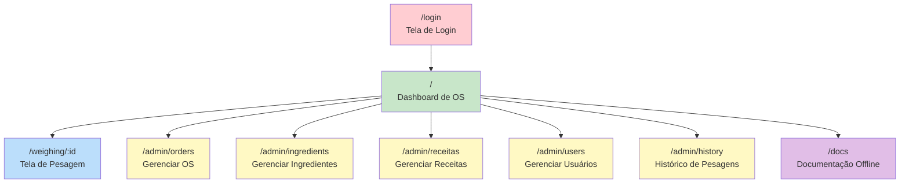
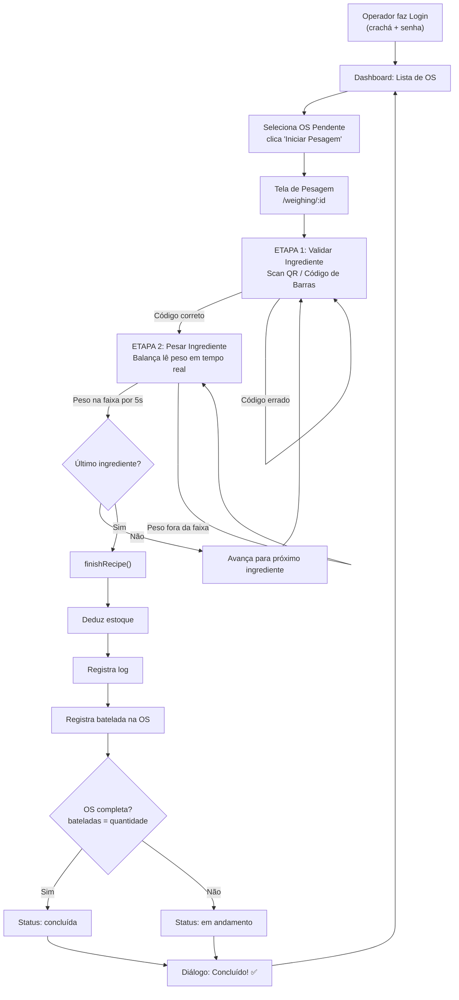



# 📦 Documento de Entrega Técnica

**Sistema de Pesagem — Protege Nutrição Animal**

| Campo | Valor |
|---|---|
| **Versão** | 1.3 |
| **Data de Entrega** | 23 de Abril de 2026 |
| **Cliente** | Protege Nutrição Animal |
| **Tipo de Entrega** | Sistema Web Embarcado (Offline-First) |
| **Classificação** | Produção — Ambiente Industrial |

---

## 1. Resumo Executivo

O **Sistema de Pesagem** é um software industrial web desenvolvido sob medida para a **Protege Nutrição Animal**, com o objetivo de automatizar, rastrear e garantir a precisão do processo de pesagem de microingredientes na produção de ração e suplementos animais.

### Problema que Resolve
Antes deste sistema, o processo de pesagem era manual, sujeito a erros humanos (troca de ingredientes, dosagem incorreta), sem rastreabilidade e sem controle digital de estoque. Isso gerava:
- Desperdício de matéria-prima
- Risco de formulação incorreta de ração
- Impossibilidade de auditar lotes retroativamente
- Falta de padronização operacional entre turnos

### Solução Entregue
Um sistema web que roda **100% offline** no chão de fábrica, sem dependência de internet, integrando-se diretamente com a balança industrial **Prix 9096H (Toledo)** via comunicação serial. O sistema:
- **Guia o operador** ingrediente por ingrediente, impedindo erros de sequência
- **Valida cada ingrediente** por código de barras/QR antes da pesagem
- **Lê o peso automaticamente** da balança em tempo real
- **Avança automaticamente** quando o peso está dentro da tolerância por 5 segundos
- **Registra tudo** com rastreabilidade completa (operador, data, pesos, receita, lote)
- **Gera etiquetas** com QR Code e código de barras para cada batelada
- **Controla o estoque** de ingredientes automaticamente

---

## 2. Escopo e Requisitos Atendidos

### 2.1. Requisitos Funcionais

| ID | Requisito | Status | Observação |
|---|---|:---:|---|
| RF-01 | Login por nome de usuário ou crachá (código de barras / QR) | ✅ Atendido | Validação contra `usuarios.json` |
| RF-02 | Dashboard com Ordens de Serviço pendentes e concluídas | ✅ Atendido | Separação por status + ordenação por urgência |
| RF-03 | Criação de Ordens de Serviço vinculadas a receitas | ✅ Atendido | Com quantidade de bateladas e flag de urgência |
| RF-04 | Fluxo de pesagem guiado (ingrediente a ingrediente) | ✅ Atendido | Sequência estrita com validação e pesagem |
| RF-05 | Validação de ingrediente por scan (QR / código de barras) | ✅ Atendido | Impede troca de ingredientes |
| RF-06 | Leitura de peso em tempo real da balança Prix 9096H | ✅ Atendido | Via Web Serial API (protocolo ENQ/STX) |
| RF-07 | Indicação visual de peso na faixa (verde) | ✅ Atendido | Borda e texto mudam de cor |
| RF-08 | Auto-avanço de 5 segundos quando peso estável na tolerância | ✅ Atendido | Contador visual + cancelamento automático |
| RF-09 | Modo individual de pesagem (tara entre ingredientes) | ✅ Atendido | Selecionável pelo administrador |
| RF-10 | Modo contínuo de pesagem (acumulativo) | ✅ Atendido | Alvo acumulado exibido automaticamente |
| RF-11 | Modo manual emergencial (digitação do peso) | ✅ Atendido | Logs marcam como `manual` para auditoria |
| RF-12 | Margem de erro configurável (%) | ✅ Atendido | Persistida no `parametros.json` |
| RF-13 | Cadastro CRUD de ingredientes com estoque | ✅ Atendido | Tela `/admin/ingredients` |
| RF-14 | Cadastro CRUD de receitas com ingredientes e pesos | ✅ Atendido | Tela `/admin/receitas` com histórico de alterações |
| RF-15 | Cadastro CRUD de usuários com níveis de acesso | ✅ Atendido | 3 níveis: administrador, usuário, operador |
| RF-16 | Dedução automática de estoque ao finalizar batelada | ✅ Atendido | Via `finishRecipe()` no servidor |
| RF-17 | Registro de log de pesagem com snapshot dos ingredientes | ✅ Atendido | `log_uso.json` com rastreabilidade completa |
| RF-18 | Geração de código de barras e QR por OS e batelada | ✅ Atendido | Via `react-barcode` e `react-qr-code` |
| RF-19 | Impressão de etiquetas (Simples e Auditoria) | ✅ Atendido | 80mm×100mm, compatível com térmicas |
| RF-20 | Edição de quantidade de bateladas (admin) | ✅ Atendido | Com validação contra concluídas |
| RF-21 | Bypass de validação de scan (admin — botão escudo) | ✅ Atendido | Para emergências com rótulos danificados |
| RF-22 | Histórico de pesagens consultável | ✅ Atendido | Tela `/admin/history` |
| RF-23 | Documentação offline acessível dentro do sistema | ✅ Atendido | Rota `/docs` com react-markdown |
| RF-24 | Funcionamento 100% offline (sem internet) | ✅ Atendido | Standalone Next.js + JSON local |

### 2.2. Requisitos Não-Funcionais

| ID | Requisito | Status | Observação |
|---|---|:---:|---|
| RNF-01 | Funcionar sem conexão com a internet | ✅ Atendido | Standalone Node.js + arquivos JSON locais |
| RNF-02 | Acessível por rede local (LAN/Wi-Fi) | ✅ Atendido | `HOSTNAME=0.0.0.0` para acesso multidevice |
| RNF-03 | Interface responsiva (desktop + tablet) | ✅ Atendido | Tailwind responsive + Sheet mobile |
| RNF-04 | Precisão de 0,01 kg (10 gramas) | ✅ Atendido | Divisão por 100 dos bytes ASCII da balança |
| RNF-05 | Atualizações de peso em tempo real (< 1 segundo) | ✅ Atendido | Polling ENQ a cada 500ms |
| RNF-06 | Compatível com Google Chrome e Microsoft Edge | ✅ Atendido | Web Serial API suportada em ambos |
| RNF-07 | Suporte à balança Toledo Prix 9096H | ✅ Atendido | Protocolo ENQ/STX documentado e testado |
| RNF-08 | Rastreabilidade completa por batelada | ✅ Atendido | Snapshot de ingredientes + operador + data |
| RNF-09 | Sem instalação de software adicional no cliente | ⚠️ Parcial | Requer Node.js portátil na máquina servidor |

---

## 3. Arquitetura do Sistema



### Stack Tecnológico

| Camada | Tecnologia | Versão |
|---|---|---|
| **Framework** | Next.js (App Router) | 15.3.8 |
| **Linguagem** | TypeScript | 5.9.3 |
| **UI** | React | 18.3.x |
| **Componentes** | Shadcn UI (Radix) | Latest |
| **Estilização** | TailwindCSS + Typography | Latest |
| **Banco de Dados** | Arquivos JSON (fs) | — |
| **Hardware** | Web Serial API (HTML5) | — |
| **Ícones** | Lucide React | 0.475.x |
| **Códigos** | react-barcode + react-qr-code | Latest |
| **Impressão** | react-to-print | 2.15.x |
| **Formulários** | react-hook-form + Zod | Latest |
| **Datas** | date-fns | 3.6.x |
| **Runtime** | Node.js | ≥ 18 LTS |

---

## 4. Modelo de Dados

Todos os dados são armazenados em **6 arquivos JSON** no diretório `/data/` do servidor:

| Arquivo | Conteúdo | Tipo |
|---|---|---|
| `ingredientes.json` | Cadastro de ingredientes com estoque | `Ingrediente[]` |
| `receitas.json` | Cadastro de receitas com ingredientes | `StoredRecipe[]` |
| `orders.json` | Ordens de serviço com bateladas | `OrdemServico[]` |
| `usuarios.json` | Cadastro de usuários do sistema | `Usuario[]` |
| `log_uso.json` | Histórico completo de pesagens | `LogUso[]` |
| `parametros.json` | Configurações globais do sistema | `Parametros` |

### Diagrama de Entidade-Relacionamento



> **Nota sobre Snapshots**: O sistema utiliza o padrão **Snapshot** para registros de pesagem. Isso significa que os dados dos ingredientes (nome e peso alvo) são "fotografados" no momento da pesagem e gravados junto com o log/batelada. Assim, mesmo que uma receita seja alterada posteriormente, os registros históricos permanecem fiéis ao que foi realmente pesado naquele momento.

---

## 5. Pré-requisitos de Infraestrutura

### 5.1. Computador Servidor (obrigatório — 1 unidade)

| Item | Requisito Mínimo | Recomendado |
|---|---|---|
| **Sistema Operacional** | Windows 10 (64-bit) | Windows 10/11 Pro |
| **Processador** | Intel Celeron / AMD equivalente | Intel i3 ou superior |
| **Memória RAM** | 2 GB livre | 4 GB+ |
| **Armazenamento** | 500 MB livre | 1 GB+ (para logs crescentes) |
| **Node.js** | v18 LTS | v20 LTS |
| **Rede** | Placa de rede Ethernet ou Wi-Fi | Ethernet cabeada (estabilidade) |
| **Porta** | TCP 3000 livre | — |

### 5.2. Terminais dos Operadores (1 ou mais)

| Item | Requisito Mínimo | Recomendado |
|---|---|---|
| **Dispositivo** | PC, notebook ou tablet com Windows/Android | Tablet com suporte |
| **Navegador** | Google Chrome 89+ ou Microsoft Edge 89+ | Chrome última versão |
| **Resolução** | 1024×768 | 1280×800+ |
| **Rede** | Conexão na mesma LAN/Wi-Fi do servidor | Ethernet cabeada |
| **Internet** | **NÃO necessária** | — |

### 5.3. Balança (1 por terminal de pesagem)

| Item | Valor |
|---|---|
| **Modelo** | Toledo Prix 9096H |
| **Interface** | RS-232 (serial) ou USB-Serial |
| **Baud Rate** | 9600 |
| **Data Bits / Parity / Stop Bits** | 8 / None / 1 |
| **Precisão** | 0,01 kg (10 gramas) |
| **Protocolo** | Frame de 17 bytes (STX + Status + Peso + Tara + CR) |

### 5.4. Periféricos Opcionais

| Periférico | Uso |
|---|---|
| **Leitor de código de barras USB** | Login por crachá + validação de ingredientes |
| **Impressora térmica 80mm** | Impressão de etiquetas de OS e bateladas |
| **Scanner QR** | Alternativa ao leitor de código de barras |

---

## 6. Estrutura de Rotas e Telas



### Controle de Acesso por Rota

| Rota | Administrador | Usuário | Operador |
|---|:---:|:---:|:---:|
| `/login` | ✅ | ✅ | ✅ |
| `/` (Dashboard) | ✅ | ✅ | ✅ |
| `/weighing/:id` | ✅ | ✅ | ✅ |
| `/admin/orders` | ✅ | ✅ | ❌ |
| `/admin/ingredients` | ✅ | ✅ | ❌ |
| `/admin/receitas` | ✅ | ✅ | ❌ |
| `/admin/users` | ✅ | ❌ | ❌ |
| `/admin/history` | ✅ | ✅ | ❌ |
| `/docs` | ✅ | ✅ | ✅ |

---

## 7. Fluxo Principal do Sistema



---

## 8. Procedimento de Instalação (Deploy)

Consulte o [Guia do Desenvolvedor — Seção 4: Deploy Standalone](./developer-guide.md) para o procedimento completo.

### Resumo:

```bash
# Na máquina do desenvolvedor:
npm run build

# Copiar para a pasta de destino (ex: C:\SistemaPesagem):
# 1. .next/standalone/*       → C:\SistemaPesagem\
# 2. .next/static/            → C:\SistemaPesagem\.next\static\
# 3. public/                  → C:\SistemaPesagem\public\
# 4. src/data/ (rename)       → C:\SistemaPesagem\data\
# 5. docs/                    → C:\SistemaPesagem\docs\
# 6. Criar iniciar.bat        → C:\SistemaPesagem\iniciar.bat
```

**Para iniciar o sistema:** Execute `iniciar.bat` no computador servidor.

---

## 9. Procedimento de Backup e Recuperação

### 9.1. O que precisa de backup

Toda a inteligência do sistema está nos **6 arquivos JSON** dentro da pasta `/data/`:

| Arquivo | Criticidade | Perda Significa |
|---|---|---|
| `orders.json` | 🔴 Alta | Perda de todas as OS e bateladas |
| `log_uso.json` | 🔴 Alta | Perda do histórico de pesagens / auditoria |
| `receitas.json` | 🟡 Média | Perda das receitas (recadastráveis) |
| `ingredientes.json` | 🟡 Média | Perda do estoque atual |
| `usuarios.json` | 🟢 Baixa | Perda dos logins (recadastráveis) |
| `parametros.json` | 🟢 Baixa | Volta para defaults (margem 1%, modo individual) |

### 9.2. Como fazer backup

```bat
@echo off
:: backup.bat — Execute periodicamente (recomendado: diariamente)
set DATA_DIR=C:\SistemaPesagem\data
set BACKUP_DIR=C:\BackupPesagem\%date:~6,4%-%date:~3,2%-%date:~0,2%

mkdir "%BACKUP_DIR%" 2>nul
xcopy "%DATA_DIR%\*.json" "%BACKUP_DIR%\" /Y /Q

echo Backup concluído em %BACKUP_DIR%
pause
```

### 9.3. Como restaurar

1. Pare o servidor (feche a janela do `iniciar.bat`)
2. Copie os arquivos `.json` do backup para `C:\SistemaPesagem\data\`
3. Reinicie o servidor executando `iniciar.bat`

### 9.4. Recomendação

- Configurar o `backup.bat` como **tarefa agendada** do Windows para executar diariamente (ex: às 23:00)
- Manter pelo menos **7 dias** de backups em rotação
- Copiar o backup para um **drive externo ou pasta de rede** periodicamente

---

## 10. Limitações Conhecidas

| # | Limitação | Impacto | Mitigação |
|---|---|---|---|
| 1 | **Web Serial API funciona apenas no Chrome e Edge** | Firefox e Safari não conseguem conectar à balança | Garantir Chrome/Edge nos terminais |
| 2 | **HTTP na rede local requer flag especial do browser** | Sem a flag, o browser bloqueia acesso serial | Configurar flag `unsafely-treat-insecure-origin-as-secure` uma única vez por terminal |
| 3 | **Banco de dados em JSON sem transações** | Em situação de escrita simultânea massiva, pode haver race condition | O cenário é improvável no uso normal (poucos operadores simultâneos) |
| 4 | **Sem sistema de backup automático nativo** | Risco de perda de dados em falha de hardware | Usar script `backup.bat` agendado |
| 5 | **Sem criptografia de senhas** | Códigos de acesso armazenados em texto puro no JSON | Aceitável para ambiente industrial fechado sem acesso externo |
| 6 | **Sem HTTPS** | Comunicação HTTP em texto puro na LAN | Rede local fechada, sem exposição à internet |
| 7 | **Estoque pode ficar negativo** | Se o admin não atualizar o estoque antes da pesagem | Verificação `apiCheckStock()` disponível mas não bloqueia pesagem |
| 8 | **Sem sincronização multi-servidor** | Apenas um servidor por instalação | Limitação aceita para o escopo do projeto |
| 9 | **Documentação embarcada requer pasta `docs/` no deploy** | Se esquecida no deploy, rota `/docs` fica vazia | Incluída no checklist de deploy |

---

## 11. Histórico de Versões (Changelog)

### v1.3 (Atual — Abril 2026)
- ✅ Implementação do protocolo de **Wake-Up (ENQ)** para balança Prix 9096H
- ✅ Rajada inicial de 3 ENQs com 150ms de intervalo para garantir resposta
- ✅ **Polling periódico** a cada 500ms para manter a balança ativa
- ✅ **Auto-avanço com timer de 5s** quando peso estável na faixa de tolerância
- ✅ **Limpeza automática** de campos ao trocar de ingrediente
- ✅ **Limpeza automática** do campo de scan ao errar a validação de ingrediente
- ✅ **Edição de bateladas** pelo administrador com validação de regra de negócio
- ✅ **Impressão Simples** de etiqueta de batelada (sem tabela de ingredientes)
- ✅ **Impressão de Auditoria** com tabela completa de ingredientes e pesos
- ✅ **Documentação embarcada** renderizada via react-markdown (rota `/docs`)
- ✅ Correção de alinhamento de UI e erros de runtime

### v1.2 (Março 2026)
- Sistema base de pesagem com modo individual e contínuo
- CRUD de ingredientes, receitas, usuários e OS
- Integração serial com Prix 9096H (sem wake-up)
- Modo manual emergencial
- Dashboard com ordens pendentes e concluídas
- Geração de QR Code e código de barras
- Sistema de autenticação com 3 níveis de acesso

### v1.0 (Fevereiro 2026)
- Prova de conceito inicial
- Interface básica com simulação de peso
- Estrutura de dados JSON

---

## 12. Plano de Testes Executados

### 12.1. Testes Funcionais

| Cenário | Passos | Resultado Esperado | Status |
|---|---|---|:---:|
| Login com nome | Digitar nome + código → Entrar | Redireciona para Dashboard | ✅ |
| Login com crachá | Escanear código de barras + código → Entrar | Redireciona para Dashboard | ✅ |
| Login inválido | Digitar credenciais erradas → Entrar | Permanece na tela de login | ✅ |
| Criar OS | Admin → OS → Nova OS → Selecionar receita, quantidade, urgência | OS aparece no Dashboard como pendente | ✅ |
| Iniciar pesagem | Clicar "Iniciar Pesagem" em OS pendente | Abre tela de pesagem com primeiro ingrediente | ✅ |
| Validar ingrediente correto | Escanear código do ingrediente correto | Badge "Item Validado ✅" aparece | ✅ |
| Validar ingrediente errado | Escanear código de outro ingrediente | Alerta vermelho + campo limpo automaticamente | ✅ |
| Pesar dentro da faixa | Balança mostra peso dentro da margem de erro | Borda verde + contador 5s inicia | ✅ |
| Auto-avanço | Peso estável na faixa por 5 segundos | Avança automaticamente para próximo ingrediente | ✅ |
| Peso sai da faixa durante contagem | Peso sai da tolerância antes dos 5s | Contador cancela automaticamente | ✅ |
| Finalizar batelada | Concluir último ingrediente | Estoque deduzido + log criado + batelada registrada | ✅ |
| OS completa | Concluir todas as bateladas de uma OS | Status muda para "concluida" | ✅ |
| Modo manual | Admin ativa modo manual → Digita peso | Peso digitado é aceito como leitura | ✅ |
| Bypass de scan (admin) | Admin clica botão escudo | Ingrediente marcado como validado sem scan | ✅ |
| Editar bateladas | Admin edita quantidade → Valor ≥ concluídas | Quantidade atualizada com sucesso | ✅ |
| Editar bateladas (inválido) | Admin tenta reduzir abaixo de concluídas | Toast de erro, quantidade não alterada | ✅ |
| Impressão Simples | Clicar "Simples" em batelada concluída | Abre preview com QR + barcode (sem ingredientes) | ✅ |
| Impressão Auditoria | Clicar "Auditoria" em batelada concluída | Abre preview com QR + barcode + tabela ingredientes | ✅ |

### 12.2. Testes de Comunicação Serial

| Cenário | Resultado | Status |
|---|---|:---:|
| Conexão com Prix 9096H via USB-Serial | Porta detectada, status "Conectado" | ✅ |
| Leitura de peso em tempo real | Peso atualiza a cada 500ms | ✅ |
| Desconexão da balança | Status muda para "Desconectado" | ✅ |
| Reconexão após desconexão | Reconecta e retoma leitura | ✅ |
| Wake-up (3 ENQs iniciais) | Balança responde após rajada | ✅ |
| Operação sem balança (modo manual) | Sistema funciona normalmente | ✅ |

### 12.3. Testes de Rede

| Cenário | Resultado | Status |
|---|---|:---:|
| Acesso local (localhost:3000) | Sistema acessível | ✅ |
| Acesso pela rede (IP:3000) | Sistema acessível de outros dispositivos | ✅ |
| Balança via HTTP na rede (com flag) | Serial funciona após configurar flag do Chrome | ✅ |

---

## 13. Guias Detalhados (Referências)

A documentação completa está organizada nos seguintes guias independentes, disponíveis na pasta `/docs/` e acessíveis pela rota `/docs` do sistema:

| Guia | Público-Alvo | Arquivo |
|---|---|---|
| [Guia do Usuário (Operador)](./user-guide.md) | Operadores do chão de fábrica | `docs/user-guide.md` |
| [Guia do Administrador](./admin-guide.md) | Supervisores e gerentes | `docs/admin-guide.md` |
| [Guia do Desenvolvedor](./developer-guide.md) | Equipe de TI e mantenedores | `docs/developer-guide.md` |
| [Blueprint Original](./blueprint.md) | Referência de projeto | `docs/blueprint.md` |

---

## 14. Glossário Técnico 

Para facilitar o entendimento de termos técnicos citados neste documento e no sistema:

- **Batelada**: Uma execução completa e fechada de uma receita. Ex: Uma OS de 5 bateladas executará a mesma receita 5 vezes.
- **Polling (Serial)**: Técnica onde o sistema (computador) pergunta continuamente à balança "Qual o seu peso agora?". No nosso sistema, ocorre a cada 500 milissegundos.
- **Web Serial API**: Tecnologia moderna inserida nos navegadores (como o Chrome) que permite ler cabos USB e seriais diretamente nas páginas da web, dispensando a instalação de programas extras.
- **Offline-First**: Filosofia de design onde o sistema é construído assumindo que não existe internet. A nuvem nunca é a fonte principal de dados, mas sim o arquivo local (`JSON Database`).
- **Margem de Erro (Tolerância)**: Faixa de variação que a balança e o sistema aceitam para considerar o peso "atingido". Ex: Uma margem de 1% em 100 kg permite concluir a pesagem entre 99 kg e 101 kg.
- **Tara**: Desconto do peso da embalagem ou balde/betoneira vazia.
- **JSON Database**: Ao invés de usar sistemas pesados como SQL Server ou Postgres (que podem falhar), os dados são salvos em formato de texto estruturado puro (JSON) na pasta do próprio sistema.

---

## 15. Plano de Treinamento e Rollout (Implantação)

Para garantir uma transição suave do método antigo para o Sistema de Pesagem 1.3, o seguinte cronograma e metodologia foram definidos:

### Fase 1: Cadastro de Massa de Dados (A cargo da Protege Nutrição Animal)
- [ ] Cadastro completo do estoque atual em `/admin/ingredients`
- [ ] Cadastro do formulário e proporções das receitas em `/admin/receitas`
- [ ] Impressão das etiquetas e afixação ou substituição de banners nas sacarias

### Fase 2: Piloto em Ambiente Controlado
- [ ] Seleção de 1 operador experiente.
- [ ] Criação de ordens de serviço (OS) de teste.
- [ ] Execução das pesagens em laboratório ou ambiente que não afete a linha principal.

### Fase 3: Treinamento da Operação
- Reunião de 30 minutos com todos os operadores do chão de fábrica para demonstração do **"Fluxo Sem Falhas"**.
- Entrega do **Guia do Operador** impresso nas estações de pesagem.
- Operação assistida pelo supervisor nas primeiras OS do dia.

### Fase 4: Go-Live (Operação Plena)
- Sistema principal descontinuando fluxos manuais de papel.
- Acompanhamento dos relatórios via `/admin/history`.

---

## 16. Garantia e Acrenses de Nível de Serviço (SLA)

| Condição | Descrição |
|---|---|
| **Período de Garantia (Bugs)** | 90 dias após a assinatura do Termo de Aceite para falhas de código ou comportamentos imprevistos dentro do escopo (Art. 2). |
| **Alterações de Escopo** | Novas funcionalidades, novos relatórios ou suporte a marcas diferentes de balança incorrerão em orçamentação separada. |
| **Resolução Crítica** | Tickets que paralisam a fábrica ("Showstopper"): Resposta em até 4 horas úteis, correção o mais breve possível (SLA alvo de 24h úteis). |
| **Resolução Secundária** | Problemas visuais, melhorias de fluxo ou correções de interface ("Cosméticas"): Resolvidos em pacotes de manutenção semanais ou quinzenais. |

---

## 17. Contato e Suporte

| Assunto | Canal |
|---|---|
| **Bugs e problemas técnicos** | Abrir issue no repositório GitHub ou contactar o desenvolvedor / mantenedor responsável. |
| **Dúvidas operacionais** | Consultar o [Guia do Operador](./user-guide.md) ou o administrador local. |
| **Alterações de receita/ingrediente** | Funcionalidade restrita aos níveis `administrador` do próprio sistema. |
| **Manutenção do servidor local** | Equipe de TI da Protege Nutrição Animal. |

---

## 18. Termo de Aceite

Eu, representante da **Protege Nutrição Animal**, declaro que:

- [ ] Recebi o sistema e os scripts instalados no ambiente de produção designado.
- [ ] Os requisitos funcionais (2.1) e não-funcionais (2.2) foram demonstrados, exauridos e validados adequadamente.
- [ ] Recebi todos os guias (Engenharia, Controle e Fábrica) anexos a este documento de entrega técnica.
- [ ] Fui instruído claramente sobre o processo fundamental de realização de rotinas de Backups (9.0).
- [ ] Conheço e atesto as limitações técnicas em ambiente Offline e Local detalhadas neste documento (10.0).
- [ ] Confirmo o início do período de aceite, ativando as rotinas e cronogramas de implantação dispostos.

| Campo | Preenchimento |
|---|---|
| **Nome do Responsável** | _________________________________ |
| **Cargo** | _________________________________ |
| **Data** | ____/____/________ |
| **Assinatura** | _________________________________ |

---

> *Documento gerado como parte da entrega técnica do Sistema de Pesagem v1.3 — Protege Nutrição Animal.*<br>
> **Suporte Comercial e Técnico:** (51) 99231-8220 | (51) 99707-1562 | comercial@codars.com.br
